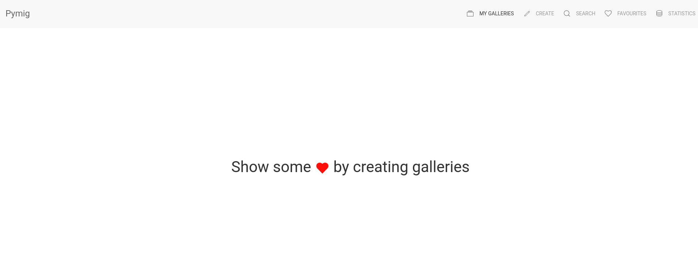

# Pymig

## TODO
- [x] Create project proposal
- [x] Create Mockups
- [x] Create basic structure / Layout for Web Application
- [x] Implement  creating a gallery
  - [x] Create page for entering data
  - [x] Create confirmation page
  - [x] Save data to JSON
- [x] Implement gallery overview
  - [x] Load available galleries from JSON
  - [x] Display loaded galleries
  - [x] Add buttons (Look at it, edit, delete)
- [x] Implement looking at the contents of a gallery (images etc.)
  - [x] Render all images inside a gallery
- [x] Implement editing a gallery
  - [x] Create edit page (probably can reuse create page and populate with data from a model)
  - [x] Save edited gallery back into JSON File
- [x] Implement deleting a gallery
  - [x] Create modal confirmation dialogue.
  - [x] Delete Gallery from JSON File
  - [x] Delete entire folder structure under static/galleries for the deleted gallery
- [x] Implement search
  - [x] Implement searching via gallery title
  - [x] Implement searching via tags
- [x] Add error handling -> Show appropriate error page.
  - [x] Create error template which takes in an error message as well as an optional navigation link
  - [x] Creating / Editing a gallery with the same name
  - [x] Validate uploaded image file names
  - [x] Validate image gallery name (e.g no empty string, should not exist already etc.)
- [x] Add responsive design and make this look fancy
  - [x] Switch to UIKit Framework
- [x] Optional stuff
  - [x] Implement dedicated page for favourite galleries
  - [x] Currently emoji css laods the emojis over the internet, investigate offline solution.
- [x] Set debug to False
- [x] Remove all print statements
- [x] Check all TODO comments

## Installationsanleitung
Zuerst muss dieses Repository lokale auf dem PC vorhanden sein hierzu muss folgender Befehl ausgeführt werden:
```
git clone https://github.com/YahArt/pymig.git
```

Anschliessend muss sichergestellt sein, dass **Flask** und **Plotly** installiert sind
```
sudo pip3 install flask
sudo pip3 install plotly
```

Um nun die Webapplikation starten zu können, muss in den Ordner navigiert werden, welcher via dem **git clone** Befehl erzeugt wurde. Anschliessend kann die Webapplikation mit folgendem Befehl gestartet werden:
```
python3 main.py
```

## Ausgangslage / Motivation

Ich möchte eine Webapplikation entwickeln, welche es einem erlaubt, auf einfach Art und Weise Bildergalerien zu erstellen. Meine Motivation dahinter ist es eine Ordnung im "Bilderchaos" von Personen zu schaffen. Auch soll mit Hilfe von Metainformationen wie Tags und Titel die erstellten Galerien durchsucht werden können.

## Funktion / Projektidee

- Galerien erstellen
- Galerien editieren
- Galerien löschen
- Galerien anschauen (Bildervorschau)
- Galerie liken
- Nach Galerien mit Hilfe von Metainformationen wie Titel und Tags suchen

## Workflow

- Zu Beginn erstellt der Benutzer Galerien. Hierzu gibt er der zu erstellenden Galerie einen Titel, Bilder sowie Metainformationen (Tags, Like-Status)
- Der Benutzer kann die erstellten Galerien in einer Übersicht ansehen.
- Der Benutzer kann die erstellten Galerien jederzeit editieren oder löschen
- Der Benutzer kann jederzeit die Bilder, welche zu einer spezifischen Galerie gehören anschauen
- Nach Galerien kann mit einer Suchfunktion gesucht werden

### Dateneingabe

Eine Galerie hat folgende Informationen, welche vom Benutzer angegeben werden müssen:

- Titel
- Bilder welche zur Galerie gehören
- Tags um eine Galerie einfach suchen zu können
- Like-Status (Favoriten)

### Datenverarbeitung / Speicherung

Als Datenspeicherung wird eine JSON Datei verwendet, diese weisst folgende Struktur auf

```json
[
    {
        "name": "FirstGallery",
        "tags": [
            "Tag1",
            "Tag2"
        ],
        "is_favourite": true,
        "images": [
            "/static/galleries/FirstGallery/house.png",
            "/static/galleries/FirstGallery/lab.png",
            "/static/galleries/FirstGallery/indoors.png"
        ],
        "description": "FirstGalleryDescription"
    }
]
```

### Datenausgabe

Wie bereits erwähnt wird die Datenstruktur als JSON Datei abgespeichert, siehe Kapitel **Datenverarbeitung / Speicherung**.

### Mockups


Dies ist die Ansicht welche der Benutzer beim Öffnen der Webapplikation sieht. Hier erhält er einen Überblick über all seine Galerien


Beim Löschen einer Galerie wird ein Dialog eingeblendet, welche den Benutzer zur Bestätigung auffordert.


Der Benutzer kann über jederzeit die Bilder, welche einer bestimmten Galerie zugeordnet sind anschauen. Hierzu klickt er einfach auf "Look at it". Anschliessend werden die Bilder der Galerie dargestellt.


Auf dieser Ansicht muss der Benutzer alle notwendigen Informationen angeben. Hierzu gehört der Name der Galerie sowie die Tags und der Like-Status. Zudem hat der Benutzer die Möglichkeit über ein "Drop-Target" verschiedene Bilder hochzuladen.


Natürlich hat der Benutzer auch die Möglichkeit eine Galerie zu editieren.


Mit Hilfe der Suchfunktion ist es sehr einfach möglich eine gewünschte Galerie zu finden. Es kann mit Hilfe der hinterlegten Tags gesucht werden. Die Suchresultate können zudem noch nach "Like-Status" gefiltert werden.

### Seitennavigation / Szenarios
Dieses Ablaufdiagramm soll veranschaulichen, wohin der Benutzer bei bestimmten Interaktionen mit der Webseite gelangt.


### Eingebaute Erweiterungen
Da ich alle die von mir vorgenommenen Punkte erreicht habe, wurde zusätzlich noch eine Statistik Seite erstellt. Auf der Statistik Seite, welche unter "Statistics" erreicht werden kann, ist eine grafische Übersicht aufgeführt, mit Hilfe welcher ersichtlich ist, welche Tags am meisten verwendet werden.

Nebst einer Statistik wurde noch ein dedizierter Bereich für die Favoriten hinzugefügt. Dieser Bereich listet alle favorisierten Galerien auf.
